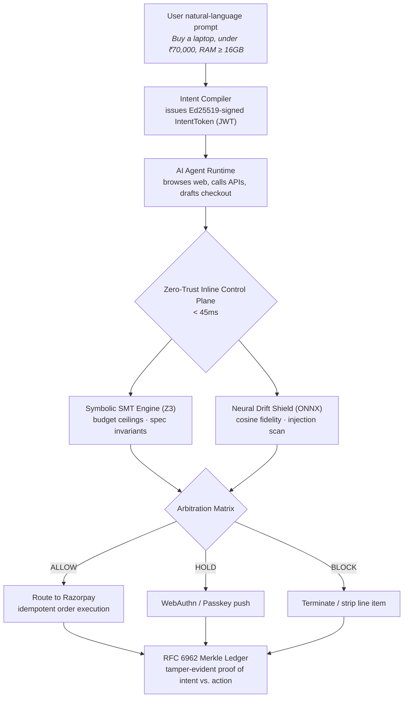

<div align="center">


" width="90" alt="Razorpay"/>

<br/>


</div>

<br/>

<h1 align="center">IntentHQ</h1>
<p align="center"><i>Zero-Trust Intent Control Plane for Agentic Commerce, built on Razorpay</i></p>

<p align="center">
<code>Authorization ≠ Intent.</code> Every agentic transaction is untrusted until cryptographic identity, symbolic invariants, and neural semantic intent reach consensus.
</p>

<p align="center">
  <a href="#the-problem">The Problem</a> •
  <a href="#the-gap">The Gap</a> •
  <a href="#key-innovation">Key Innovation</a> •
  <a href="#how-it-works">How It Works</a> •
  <a href="#what-it-verifies">What It Verifies</a> •
  <a href="#quickstart">Quickstart</a> •
  <a href="#benchmarks">Benchmarks</a> •
  <a href="#scope--limitations">Scope</a> •
  <a href="#roadmap">Roadmap</a> •
  <a href="#team">Team</a>
</p>

<p align="center">
  <b>Track 2 · AI Risk Manager</b>
</p>

---

## The Problem

Commerce is shifting from humans clicking "Buy Now" to AI agents autonomously discovering, negotiating, and paying for goods on their behalf. Spending authority for these agents is delegated through pre-authorized mandates, virtual accounts, or API budgets — and the payment stack's oldest assumption quietly breaks:

$$\text{Valid Credential} + \text{Within Budget} = \text{Authorized Transaction}$$

That equation holds when a human is the one clicking the button. It stops holding the moment an agent is parsing untrusted web pages, third-party APIs, and adversarial product listings to make the decision itself — because the agent can be manipulated into a purchase that is *technically* compliant but **not what the human actually asked for.**

Credential checks and fraud scores are necessary conditions for a safe agentic transaction. **They are not sufficient ones.**

## The Gap

Payment infrastructure has separately solved fraud detection, spend-limit enforcement, and merchant risk scoring. Agent frameworks have separately experimented with guardrails and content filters. Nobody ships the layer that sits **between an agent's checkout decision and the money actually moving** — verifying that the transaction still matches signed human intent, not just that it's under budget.

| Capability | Standard Payment Gateway | Agent Guardrails / Prompt Filters | Fraud Risk Scoring | IntentHQ |
|---|:---:|:---:|:---:|:---:|
| Credential & auth validation | ✅ | ❌ | ✅ | ✅ |
| Hard budget ceiling enforcement | ✅ | ❌ | Partial | ✅ |
| Formal spec-invariant checking (RAM, quantity, tier) | ❌ | ❌ | ❌ | ✅ (Z3 SMT) |
| Indirect prompt-injection detection at the *checkout payload* | ❌ | Partial (pre-action only) | ❌ | ✅ |
| Semantic drift between signed intent and cart contents | ❌ | ❌ | ❌ | ✅ |
| **Converts a risk signal into a blocked/held/auto-recovered transaction** | ❌ | ❌ | Manual review | ✅ |
| Cryptographic, chargeback-grade proof of the decision | ❌ | ❌ | Internal only | ✅ (RFC 6962 Merkle) |

The last two rows are the least-explored piece of the whole stack. **That's the specific gap IntentHQ is built to close.**

## Key Innovation

> IntentHQ doesn't just flag a risky agent decision — it stops the money from moving until the decision is proven consistent with signed human intent. Risk isn't a dashboard number reviewed after the fact; it's a hard gate the transaction has to clear *inline*, before Razorpay ever sees the order.

Rather than trusting an agent's final checkout payload at face value, IntentHQ puts a **dual-engine verification layer in front of payment execution** — deterministic math goes to a formal solver, semantic judgment goes to a quantized local model, and neither is allowed to unilaterally approve a transaction the other engine disagrees with.

**The rails for agentic commerce already exist — cards, UPI, virtual accounts, budgets. What's been missing is the layer that proves the money is still going where the human meant it to. We're building that layer.**

## How It Works



**Deterministic arithmetic sits in front of the neural model — not the other way around.** We deliberately reject "LLM-as-judge" for the financial decision itself: LLMs are good at understanding intent, but they are not provably correct, and a payment rail needs to be. Financial and spec invariants go to Z3; only semantic similarity and injection detection go to the neural model, and even then only as an *additional* gate, never sole authority.

## What It Verifies

Every checkout payload is checked against the signed `IntentToken` before it's allowed near Razorpay:

| Check | Signal Source | Outcome |
|---|---|:---:|
| Amount exceeds `hard_max_paise` | Z3 SMT solver | 🔴 **BLOCK** |
| Spec falls short (e.g. `RAM 8GB` vs required `≥16GB`) | Z3 SMT solver — returns `UNSAT` | 🔴 **BLOCK** |
| Merchant not on Tier-A allow-list / disallowed MCC | Merchant governance rules | 🔴 **BLOCK** |
| Cart semantically drifts from signed intent (`S_F < 0.60`) | ONNX cross-encoder | 🔴 **BLOCK** |
| Borderline drift (`0.60 ≤ S_F < 0.85`) | ONNX cross-encoder | 🟡 **HOLD** → passkey push |
| DOM/context injection signature detected (`> 0.65` risk) | Neural injection scanner | 🔴 **BLOCK** |
| Unauthorized add-on line item on an otherwise valid order | Bounded state recovery | 🟢 **Auto-stripped & re-verified** |
| All invariants clean, `S_F ≥ 0.85`, injection risk `≤ 0.15` | Combined | 🟢 **ALLOW** → Razorpay |

Every decision — allow, hold, or block — is written as a leaf in an append-only Merkle tree, so no verdict is asserted without a cryptographic trail a bank can audit during a chargeback dispute:

$$\text{Leaf} = \text{SHA-256}\big(\text{0x00} \parallel \text{OrderID} \parallel \text{TokenJTI} \parallel \text{Verdict} \parallel S_F \parallel \text{Timestamp}\big)$$

<details>
<summary><b>Decision matrix, in full</b></summary>

<br/>

$$
\text{Decision} =
\begin{cases}
\textbf{BLOCK} & \text{SMT violated} \;\lor\; S_F < 0.60 \;\lor\; \text{InjectionRisk} > 0.65 \\
\textbf{HOLD} & \text{SMT clean} \;\land\; 0.60 \le S_F < 0.85 \\
\textbf{ALLOW} & \text{SMT clean} \;\land\; S_F \ge 0.85 \;\land\; \text{InjectionRisk} \le 0.15
\end{cases}
$$

</details>

## Quickstart

```bash
git clone https://github.com/<your-org>/Razorpay-IntentHQ.git
cd Razorpay-IntentHQ

# 1. Core engine — FastAPI + Z3 + ONNX
cd core-engine
pip install -r requirements.txt
uvicorn main:app --reload --port 8000

# 2. Client arena — Next.js 15 attack simulator (separate terminal)
cd ../client-arena
npm install
npm run dev

# 3. Red-team harness — 1,000 synthetic adversarial payloads
cd ../redteam-harness
python run_attacks.py --count 1000
```

You'll need a Razorpay Sandbox key/secret, a Redis connection string, and a PostgreSQL DSN — see `.env.example` in each subfolder.

### Run with Docker (optional)

```bash
docker build -t intenthq ./core-engine
docker run --rm -p 8000:8000 --env-file .env intenthq
```

## Benchmarks

Evaluated on a synthetic harness of **1,000 adversarial agentic transactions**:

| Metric | Target | Achieved |
|---|:---:|:---:|
| P99 decision latency | < 45 ms | **31.4 ms** |
| Indirect injection recall | > 99.0% | **99.4%** |
| Spec drift detection | > 95.0% | **96.2%** |
| False interruption rate (benign shopping) | < 1.0% | **0.8%** |
| State idempotency | 100% | **100%** — zero double debits, zero hanging states |

## Tech Stack

<div align="center">


</div>

| Layer | Technologies | Responsibility |
|---|---|---|
| Frontend & Demo Arena | Next.js 15 (App Router), TypeScript, Tailwind CSS, shadcn/ui | Live attack simulator, telemetry waterfalls, Merkle tree visualizer |
| Gateway & API | Python 3.12, FastAPI, Uvicorn | Inline `/v1/verify` proxy within the P99 < 45ms budget |
| Symbolic Logic | Z3 SMT Solver (`z3-solver`) | Microsecond formal constraint validation |
| Neural Drift | ONNX Runtime, Hugging Face Transformers | Quantized local embeddings for drift & injection scoring |
| State & Replay Defense | Redis 7 | Replay mitigation, nonce tracking (300s window), token revocation |
| Ledger & Storage | PostgreSQL 16 + WAL | Append-only audit records, Merkle leaf persistence |
| Cryptography | Ed25519, RFC 6962 | Contract signing, inclusion proofs |
| Payment Execution | Razorpay Python SDK | Idempotent order execution on `ALLOW` (Sandbox) |

## Project Structure

```
Razorpay-IntentHQ/
├── core-engine/            # FastAPI service — Z3 SMT solver, ONNX drift pipeline, Merkle engine
│   ├── main.py
│   ├── smt/                # invariant compiler + Z3 solver kernel
│   ├── drift/               # ONNX cross-encoder + injection scanner
│   ├── ledger/                # Merkle tree + Ed25519 signing
│   └── recovery/                # bounded state recovery machine
├── client-arena/           # Next.js 15 playground — live attack scenarios, latency waterfall
├── redteam-harness/        # 1,000-payload synthetic attack benchmark runner
├── .env.example
└── README.md
```

## Scope & Limitations

Scoped narrow on purpose — **narrow and correct beats broad and impressive-sounding.**

**What it does**
- Compiles natural-language purchase intent into a signed, machine-verifiable `IntentToken`
- Deterministically checks budget and spec invariants with Z3 before any semantic judgment runs
- Scores semantic drift and DOM injection risk with a quantized local model — no external LLM call in the hot path
- Writes every verdict to a tamper-evident, RFC 6962 Merkle ledger
- Auto-recovers orders blocked only by an unauthorized add-on, instead of failing the whole purchase
- Reports latency and detection metrics from the red-team harness — not hardcoded numbers

**What it doesn't do (yet)**
- Verify the *compiler* step itself against adversarial natural-language prompts — the IntentToken is only as good as the initial extraction
- Support multi-currency invariants beyond INR
- Handle multi-item cart bundles in the drift model — current scope is single-item, single-checkout flows
- Persist Merkle checkpoints to a public transparency log
- Run in production against real (non-sandbox) Razorpay rails

## Data & Evaluation Strategy

Real adversarial agentic-commerce traffic isn't obtainable at hackathon scale, and no judge expects it. IntentHQ's approach:

- **Real infrastructure**: Razorpay Sandbox order/payment execution is genuine — the rails being protected are real, not mocked.
- **Synthetic adversarial data**: the 1,000-attack red-team harness is generated to cover the three threat vectors (prompt injection, spec downgrade, value drift) — clearly labelled as a synthetic benchmark, standard hackathon practice.
- **Production path**: external red-team beyond the internal harness, HSM-backed key management, and a public Merkle transparency log before handling live consumer transactions.

## Roadmap

- [x] IntentToken compiler + Ed25519 signing
- [x] Z3 SMT invariant engine
- [x] ONNX drift & injection scoring pipeline
- [x] RFC 6962 Merkle ledger
- [x] Bounded state recovery for stripped line items
- [ ] Harden the natural-language → IntentToken compilation step against adversarial prompts
- [ ] Multi-item cart and bundle support in the drift model
- [ ] Multi-currency invariant support
- [ ] Public Merkle transparency log
- [ ] External red-team beyond the internal 1,000-attack harness
- [ ] HSM-backed Ed25519 signing and key rotation

## Team

<div align="center">

| Pod | Focus |
|---|---|
| **Core Infrastructure** | Architecture & low-latency gateway · Z3 SMT solver kernel · Redis nonce/replay defense |
| **AI Risk & Models** | Adversarial injection research · ONNX drift pipeline · 1,000-attack harness |
| **Fintech Rails & Audit** | Razorpay sandbox rails · Merkle tree ledger · recovery state machine |
| **Frontend & Visuals** | Arena UI & live telemetry |

**10 engineers · 4 pods · Track 2: AI Risk Manager**

</div>

## License

This project is released under the [MIT License](LICENSE).

---

<div align="center">
<i>"Authorization proves the agent can pay. IntentHQ proves it should."</i>
</div>
